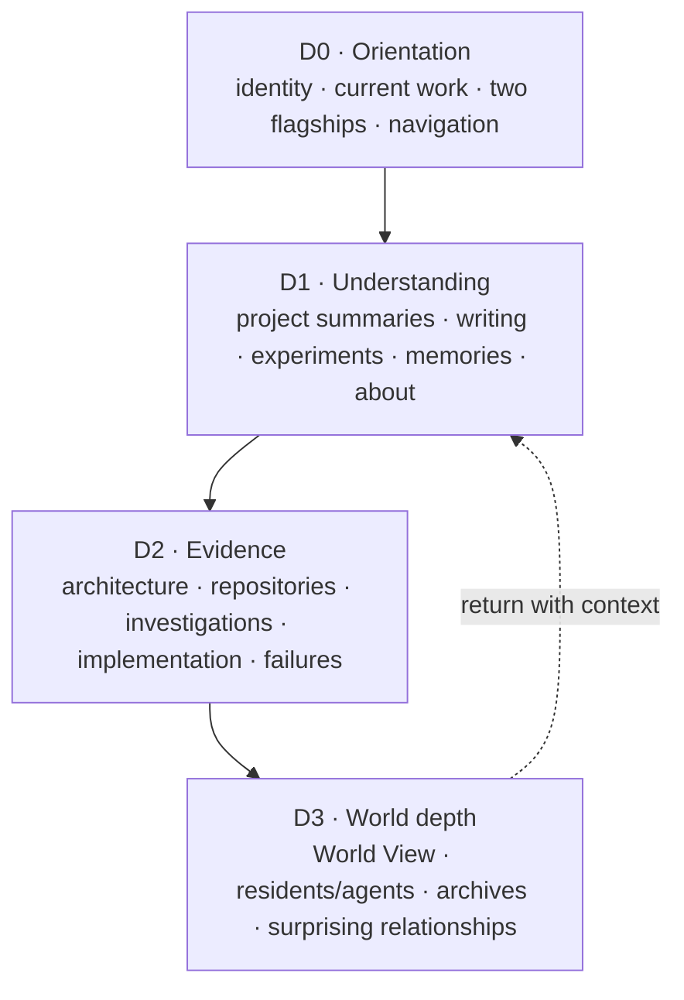
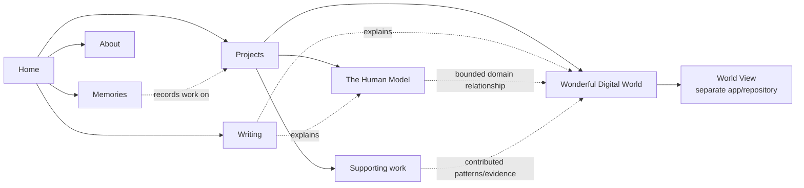

# Product and information architecture

## Product definition

This site is the public interface to Haley Parks's independent, one-person
technology lab. Its job is to make the lab legible: what is being built, why it
matters, what evidence exists, how the ideas relate, and what has been learned.
It is not a résumé dressed as a project grid and it is not a simulation of the
systems it describes.

The Human Model and Wonderful Digital World are the two flagships:

- **The Human Model** explores how evidence, uncertainty, interventions, and
  outcomes can form a longitudinal representation of a changing person.
- **Wonderful Digital World** explores persistent computational environments
  that reduce mechanical orchestration while preserving human authority.

Their relationship is conceptual, not a repository merger. The Human Model is a
bounded human-domain model. Wonderful Digital World is a broader persistent
environment with explicit domain ownership, evidence, durable work, residents,
projections, and proposed actions.

Writing explains these systems. World View shows a viewer-scoped projection of
Wonderful Digital World. The site links those roles together while keeping
their implementation and license boundaries intact.

## Audience promises

- A first-time visitor can understand Haley's current thesis and the two
  flagship projects without knowing the repository history.
- A technical reader can descend from a plain-language summary to architecture,
  evidence, implementation, and repository sources.
- A returning reader can find recent writing, memories, and work in progress.
- A collaborator can distinguish shipped evidence from intent, experiments,
  and future work.
- No visitor is asked to infer provenance, status, or the boundary between the
  editorial site and a separate application.

## Proposed route model

| Surface    | Role                                                        | Primary?   | Notes                                                                         |
| ---------- | ----------------------------------------------------------- | ---------- | ----------------------------------------------------------------------------- |
| Home       | Identity, current thesis, two flagships, recent work        | Yes        | Restrained overview, not a giant hero or card wall                            |
| Projects   | Flagships plus supporting work                              | Yes        | Editorial index with explicit kinds and statuses                              |
| Writing    | Essays and explanations                                     | Yes        | The explanatory layer                                                         |
| Memories   | Observations, decisions, experiments, fragments, milestones | Yes        | Independent archive; no legacy compatibility route                            |
| About      | Haley, practice, principles, contact                        | Yes        | Human context, not a separate manifesto theme park                            |
| World View | Linked application/repository context                       | Contextual | Belongs under WDW context; not global chrome until a stable deployment exists |
| Explore    | Trails, topics, archive, everything                         | Secondary  | Discovery mechanism rather than equal primary destination                     |
| Search     | Query interface                                             | Utility    | Available globally without competing with editorial navigation                |

The final primary navigation label set and URL migration are WP2 decisions.
WP1 defines the hierarchy but does not change routes.

## Four depths

Depth is about the amount of context required, not prestige. A visitor should
never need D3 knowledge to understand D0, and D3 should never leak private or
unreviewed state.

## Content relationships

## Editorial composition direction

WP2 should use an editorial mosaic: a deliberate mixture of full-width
statements, two-column project narratives, compact evidence lists, chronology,
and occasional diagrams. “Mosaic” does not mean a responsive card grid. Each
module must earn its shape from the content and reading order, and the DOM order
must remain coherent at narrow widths.

Recommended homepage sequence:

1. concise identity and lab thesis;
2. current work/status;
3. The Human Model flagship narrative;
4. Wonderful Digital World flagship narrative and factual World View link;
5. recent writing and memories;
6. selected supporting experiments;
7. compact About/contact context.

## Guardrails

- Do not reproduce World View's pixel-art rooms, nodes, or spatial interface.
- Do not turn every content type into an equal card.
- Do not expose experimental or archived work as if it were a flagship.
- Do not equate an agent with an unlabelled author; attribution and human review
  must be explicit.
- Do not use graphical relationships when a link and one sentence are clearer.
- Keep source repositories canonical for implementation detail.
