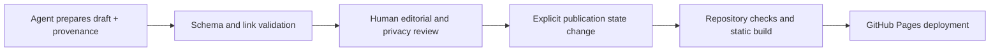

# Technical foundation

## Decision

Keep Astro, the existing content-collection approach, static output, and GitHub Pages deployment. The current stack already supports semantic HTML, build-time validation, low-JavaScript routes, and incremental content migration. Replatforming would add risk without solving a WP1 problem.

## Repository boundaries

| System                  | Responsibility                                                   | Website relationship                                                       |
| ----------------------- | ---------------------------------------------------------------- | -------------------------------------------------------------------------- |
| This repository         | Public editorial interface and evidence index for Haley's work   | Owns summaries, essays, memories, and curated links                        |
| Wonderful Digital World | Portable architecture for a persistent computational environment | Flagship project; link to its public repository and explain it editorially |
| World View              | Independent isometric viewer and pixel-art renderer              | External implementation evidence; link with provenance and license context |

World View remains a separate application and GPL-licensed derivative codebase. The website should not copy its renderer, reproduce its rooms as decoration, or imply that a CSS network is the application. If WP2 needs visual evidence, use an attributed static image with appropriate rights and a normal outbound link. Do not iframe the application by default.

## Incremental implementation path

1. Introduce the opt-in token layer and typography on one representative editorial prototype.
2. Add target fields to Astro schemas with compatibility defaults.
3. Migrate the two flagship records and validate their evidence links.
4. Build textual project and writing indexes from canonical collection data.
5. Migrate route-backed content without changing established canonical URLs.
6. Add Memories only after privacy and publishing tests exist.
7. Remove duplicated homepage data and decorative graph treatments after their replacements ship.

Each step should leave the production build valid and existing public routes reachable.

## Agent-assisted publishing boundary

Future agents may prepare a draft file and evidence manifest. They may not publish merely because generation succeeded.

The pipeline must preserve the source revision, separate draft/review/published states, and fail closed on missing privacy or authorship metadata. WP1 supplies only the reference types and documentation; it does not create automation.

## Accessibility strategy

- Preserve landmark structure, skip navigation, logical heading order, and visible keyboard focus.
- Use links for navigation and buttons for state changes.
- Make D2/D3 disclosure keyboard-operable with native elements where possible.
- Never encode status or project identity by color alone.
- Require useful alternative text for evidence images; decorative imagery gets empty alternative text.
- Test zoom, reflow, reduced motion, forced colors, and keyboard-only traversal on representative routes.
- Treat the World View application as external content with a textual explanation; the website introduction must not require operating a canvas.

## Responsive strategy

Content order, not desktop geometry, defines the narrow-screen experience. The proposed twelve-column editorial grid collapses to four columns and then a single flow. Evidence metadata wraps rather than truncates. Page titles remain bounded at 44 px, touch targets keep adequate space, and horizontal scrolling is reserved for genuinely tabular or code content.

## Performance targets for WP2 prototypes

- Ship no client JavaScript on ordinary editorial routes unless an interaction needs it.
- Keep route-specific first-party JavaScript under 30 KB compressed.
- Limit typography to two families and measured, subset WOFF2 files.
- Use responsive image sources with dimensions; lazy-load below-fold evidence.
- Target p75 LCP at or below 2.5 seconds, CLS at or below 0.1, and INP at or below 200 ms on representative production traffic.
- Preserve static HTML output and verify budgets before expanding an interactive treatment.

These are project budgets, not claims about the current site. WP2 should record measured baselines before implementation.

## Validation contract

Every migration slice should run formatting, Astro diagnostics, the static build, relationship validation, and internal-link validation. Representative manual checks should cover Home, Projects, The Human Model, one writing route, one deep evidence route, and the 404 page.
