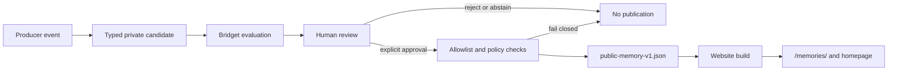

# WP5 publication pipeline

Replay uses the same stable candidate ID and produces one logical memory. Export is deterministic for a supplied generation time, sorts public records consistently, and atomically replaces the artifact. A failed write can be retried without changing publication authority or exposing a partial file.

The checked-in website projection contains manually reviewed editorial seeds, not test fixtures. Synthetic records used by the end-to-end test stay inside the test environment.
